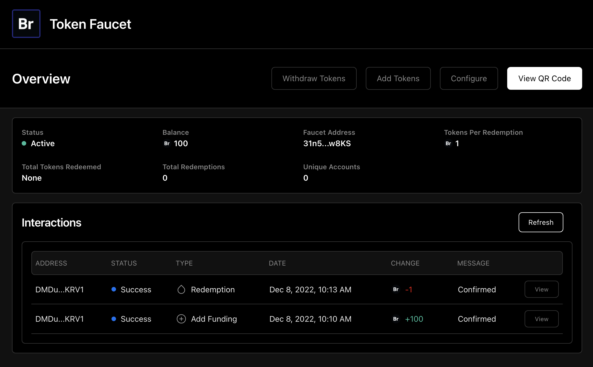

import { IncompleteCallout } from '../../components/IncompletePost'

# Durable Transaction Status Tracking

<IncompleteCallout />

This is part 3 of a 10-part series on advanced Solana Pay development that you will teach you how to create a Solana token faucet that distributes SPL tokens via a QR code. 

If you haven't already, checkout the [first part](/solana-pay/introduction) of this series to get started.

## Lesson Overview
Solana transactions are processed asynchronously by the Solana blockchain. Transactions are constructed by the client, signed, and sent to RPC nodes to be broadcast to the network. 
The client then waits for the transaction to be processed and confirmed. This process usually takes a few seconds. Once a transaction has reached a state of `confirmed`, it is [very unlikely](https://docs.solana.com/cluster/commitments) the transaction will fail (a confirmed transaction has [never](https://solana.stackexchange.com/questions/4455/what-is-the-of-confirmed-transactions-that-get-subsequently-dropped/4500#4500) been rolled back).

A client must poll the Solana blockchain via RPC nodes in order to retrieve the status of a transaction. This polling process is a crucial element of nearly any application built on Solana. 
In this lesson, we will discuss several of the common pitfalls of basic polling strategies and implement a more robust polling mechanism for our Solana Pay SPL token faucet based around a [Redis task-queue](https://docs.bullmq.io/).

## Naive Polling
Within our SPL token faucet, we have a function that polls the Solana blockchain for the status of a transaction and stores this information in the `scans` table of our database. Open `src/server/services/scan/scan.service.ts` and take a look at the `confirmTransaction` method:

```typescript
class ScanService {
// ...
private confirmTransaction = async (
    ref: string,
    scanId: string,
  ): Promise<void> => {
    let signature: string | null = null;
    try {
      /**
       * Try to confirm the transaction 60 times
       * waiting 2 seconds between each attempt.
       */
      for (let i = 0; i < 60; i++) {
        await WaitUtil.wait(2000);
        const signatures = await RPCConnection.getSignaturesForAddress(
          new PublicKey(ref),
          {},
          'confirmed',
        );

        if (signatures.length > 0) {
          signature = signatures[0]?.signature ?? null;

          await prisma.scan.update({
            where: { id: scanId },
            data: { signature, message: 'Confirmed', state: 'Confirmed' },
          });

          break;
        }
      }

      /**
       * Mark the transaction as failed if it was not confirmed
       */
      if (!signature) {
        prisma.scan.update({
          where: { id: scanId },
          data: {
            signature: null,
            message: 'Failed to confirm in 2 minutes',
            state: 'Failed',
          },
        });
      }
    } catch (e) {
      console.error(`Error confirming transaction for scanId ${scanId}`);
      console.error(e);
    }
  };
// ...
}
```

This method takes two parameters: 

1. `ref` - a base58-encoded reference to a Solana transaction (more on this later)
2. `scanId` - the unique database identifier of the `scan` record that initialized this transaction


This method is called each time a new `scan` record with a `state` field of `Scanned` is created. The `state` field of `Scanned` indicates that the transaction has been broadcast to the Solana blockchain, but has not yet been confirmed or marked as failed.


The `confirmTransaction` method starts a `for` loop that will attempt to confirm the transaction 60 times, waiting 2 seconds between each attempt. 
On each attempt, the method asks the Solana network for a list of all the signatures associated with the `ref` address. We are using the `confirmed` commitment level meaning
the network will only return signatures for transactions that have been confirmed. Since we generate a unique `ref` to track every transaction we create, 
we assume that the first signature returned is the signature of the transaction we are looking for (if there is more than one signature returned, something likely went wrong).

When the `for` loop finds a signature, it updates the `scan` record in the database with the signature of the transaction and sets the `scan` state to `Confirmed`. 
If the `for` loop does not find a signature within 2 minutes, it stops polling and marks the `scan` record state as `Failed`.

This simple approach to polling may work for small applications but is ultimately flawed. Function execution is not persisted between application restarts meaning the `for` loop 
in this method will terminate and the transaction status will not be tracked properly if the application process is killed, crashes, or is restarted.

## Redis Task Queue

A more robust polling strategy is to use a task queue to coordinate the tracking of transaction statuses. The state of our task queue is stored external to our application in Redis, meaning process termination will not affect the state of the queue.

We will add the following tech to our application in order to accomplish this:
1. [Redis](https://github.com/microsoft/TypeScript) - Highly available key-value store
2. [BullMQ](https://docs.bullmq.io/)- Fast and robust queue system built on top Redis

At a high level, BullMQ allows us to create tasks that are stored in Redis and executed by a worker. In our case, the worker shares the same process as the rest of our application, but workers can easily be run in separate processes or even on separate machines. 
If the application process is terminated, the tasks in the queue will be re-queued and executed when the application is restarted.

We will be creating a task that replaces the `confirmTransaction` method that currently exists but will instead use BullMQ to reliably track the status of the transaction.

### Add Dependencies

In the root folder of the project, checkout the `durable-tracking` branch:
```bash
git checkout durable-tracking
```
**Note:** We are changing branches here to stay organized. There aren't any code changes between the end of [lesson 2](/solana-pay/getting-started) and the start of this lesson. In future lessons, this may not be the case.

Install BullMQ:

```bash
$ npm install --save bullmq
```

### Redis
Follow the instructions [here](https://redis.io/docs/getting-started) to install Redis locally on your machine. Once Redis is installed, start the Redis server:

```bash
$ redis-server
```

This command will start a local instance of Redis on port `6379`. We now need to update our `.env` file to point to our Redis instance. Open `.env` and add the following line:

```bash
REDIS_CONNECTION_STRING=redis://localhost:6379
```

This is the default Redis connection string for a locally hosted Redis instance. If you are using a remote instance, replace this value with your connection string.

### Task Service

Create a new folder called `src/server/services/task`. In the new `task` folder, create a file called `task.service.ts` and paste the following code. 
This file will contain the logic for creating and processing tasks. We will review how this code works in the next section:

```typescript
import { router, publicProcedure } from '../../trpc';
import { z } from 'zod';
import RPCConnection from '~/server/utils/RPCConnection';
import { PublicKey } from '@solana/web3.js';
import { Job, Queue, Worker } from 'bullmq';

export type TaskTypes = 'Confirm Transaction';

type TaskData = {
  type: TaskTypes;
  scanId: string;
  ref: string;
};

const TASK_QUEUE_NAME = 'faucet-tasks';

const redisUrl = new URL(String(process.env.REDIS_CONNECTION_STRING));

const connection = {
  host: redisUrl.hostname,
  port: parseInt(redisUrl.port, 10),
  username: redisUrl.username,
  password: redisUrl.password,
};

export const MAX_ATTEMPTS_PER_TASK = 40;
export const ATTEMPT_MS_DELAY_PER_TASK = 3000;

class TaskService {
  private queue: Queue = new Queue(TASK_QUEUE_NAME, {
    connection,
    defaultJobOptions: {
      attempts: MAX_ATTEMPTS_PER_TASK,
      backoff: {
        type: 'fixed',
        delay: ATTEMPT_MS_DELAY_PER_TASK,
      },
    },
  });

  private worker: Worker;

  public get router() {
    return router({
      create: this.create,
    });
  }

  appCaller: any = null;

  public setAppCaller = (caller: any) => {
    this.appCaller = caller;
  };

  constructor() {
    this.worker = new Worker(TASK_QUEUE_NAME, this.run, { connection });

    this.worker.on('error', console.error);
  }

  private info = (job: Job, status: string) => {
    console.log(
      `Job ID: ${job.id} | Status: ${status} | Attempt: #${job.attemptsMade}`,
    );
  };

  private run = async (job: Job<TaskData>) => {
    this.info(job, 'Running');

    const {
      data: { type },
    } = job;

    const executor: ((job: Job) => Promise<void>) | null = (() => {
      switch (type) {
        case 'Confirm Transaction':
          return this.confirmTransaction;
        default:
          return null;
      }
    })();

    if (!executor) {
      return;
    }

    await executor(job);
  };

  public createInput = z.object({
    scanId: z.string(),
    ref: z.string(),
    type: z.string(),
  });

  public create = publicProcedure
    .input(this.createInput)
    .mutation(async ({ input }) => {
      const { scanId, ref, type } = input;
      const name = `${type} for scan ${scanId}`;

      try {
        const job = await this.queue.add(
          name,
          {
            scanId,
            ref,
            type,
          },
          {
            delay: 0,
          },
        );

        return job.id;
      } catch (e) {
        return null;
      }
    });

  private confirmTransaction = async (job: Job<TaskData>) => {
    const {
      data: { scanId, ref },
    } = job;

    const signatures = await RPCConnection.getSignaturesForAddress(
      new PublicKey(ref),
      {},
      'confirmed',
    );
    const signature: string | null = signatures?.pop?.()?.signature ?? null;
    const isLastAttempt = job.attemptsMade >= MAX_ATTEMPTS_PER_TASK;

    if (signature) {
      await this.appCaller.scan.update({
        id: scanId,
        message: 'Confirmed',
        state: 'Confirmed',
        signature,
      });

      this.info(job, 'Completed');
    } else if (isLastAttempt) {
      const message = `Failed to confirm in ${
        (MAX_ATTEMPTS_PER_TASK * ATTEMPT_MS_DELAY_PER_TASK) / 60 / 1000
      } minutes`;

      await this.appCaller.scan.update({
        id: scanId,
        message,
        state: 'Failed',
        signature: null,
      });

      this.info(job, 'Failed');
    } else {
      throw new Error(
        `Could not find transaction with ref ${ref}. Trying again...`,
      );
    }
  };
}

export default new TaskService();

```

### App Router
We need to update the app router to include the task service. This will allow our other backend services to call the new task service. Open `src/server/appRouter.ts` and add the lines below:

```diff
import { router } from './trpc';
import scanService from './services/scan/scan.service';
import faucetService from './services/faucet/faucet.service';
+ import taskService from './services/task/task.service';

export const appRouter = router({
  faucet: faucetService.router,
  scan: scanService.router,
+ task: taskService.router,
});

export const appCaller = appRouter.createCaller({});

faucetService.setAppCaller(appCaller);
scanService.setAppCaller(appCaller);
+ taskService.setAppCaller(appCaller);

export type AppRouter = typeof appRouter;

```

### Scan Service
We need to update the scan service to use the new task service when a new `scan` is created. Open `src/server/services/scan/scan.service.ts` and update the `create` method to look like this:

```typescript
class ScanService {
//...
  public create = publicProcedure
    .input(this.createInput)
    .mutation(async ({ input }) => {
      const scan = await prisma.scan.create({
        data: input,
        select: ScanService.ScanSelect,
      });

      /**
       * Create a task to confirm the transaction
       */

      if (scan.state === 'Scanned') {
        this.appCaller.task.create({
          scanId: scan.id,
          ref: scan.ref,
          type: 'Confirm Transaction',
        });
      }

      return scan;
    });
//...
}
```

### Start Faucet

From the root of the project, start the application:

```bash
$ npm run dev
```

Make sure that [ngrok](http://localhost:3001/solana-pay/getting-started#tls) is running and that the `NEXT_PUBLIC_SOLANA_PAY_TLS_SERVER_ADDRESS` variable is properly set in `.env`. To start ngrok, open a new terminal tab and run:

```bash
$ ngrok http 3000
```

Open your web browser to http://localhost:3000. The UI should similar to the image below. You may have a few more rows in the interactions table depending on how many times you have used the faucet:



Click the `View QR Code` button and scan the QR code with a Solana Pay compatible mobile wallet to redeem tokens. Do not click confirm when the Solana Pay interface loads. As soon as the QR code is scanned, you should see terminal output similar to:

```bash
Job ID: 4 | Status: Running | Attempt: #1
Job ID: 4 | Status: Running | Attempt: #2
Job ID: 4 | Status: Running | Attempt: #3
```


This is our task queue attempting to confirm the transaction. Refresh the browser UI and you will see your transaction "In Progress" in the interactions table:


Confirm the transaction in your mobile wallet and the task queue will log a success message:

```bash
Job ID: 4 | Status: Completed | Attempt: #3
```

Refresh the browser UI and you will see your transaction "Confirmed" in the interactions table:


Our task queue has successfully confirmed the transaction and updated the `scan` record in the database!

### Review

Our new task service handles creating a BullMQ task queue called `faucet-tasks` and instantiating a worker to process these tasks. We create the queue with: 
```typescript
//...
const TASK_QUEUE_NAME = 'faucet-tasks';
//...
export const MAX_ATTEMPTS_PER_TASK = 40;
export const ATTEMPT_MS_DELAY_PER_TASK = 3000;

class TaskService {
  private queue: Queue = new Queue(TASK_QUEUE_NAME, {
    connection,
    defaultJobOptions: {
      attempts: MAX_ATTEMPTS_PER_TASK,
      backoff: {
        type: 'fixed',
        delay: ATTEMPT_MS_DELAY_PER_TASK,
      },
    },
  });
  //...
}
```

We specify the maximum number of attempts to process a task (40) and the delay between attempts in milliseconds (3000). 
This means we will try to confirm each transaction up to 40 times with a delay of 3 seconds in between attempts for total of 2 minutes.
Behind the scenes, BullMQ manages the requeuing and processing of tasks according to the values we have specified.

We create a worker in the constructor of the task service class and specify the `run` method as a our task executor. We also add an event listener to log errors if our worker encounters any:

```typescript
//...
class TaskService {
//...
  constructor() {
    this.worker = new Worker(TASK_QUEUE_NAME, this.run, { connection });
 
    this.worker.on('error', console.error);
  }
  //...
  private run = async (job: Job<TaskData>) => {
    this.info(job, 'Running');
 
    const {
      data: { type },
    } = job;
 
    const executor: ((job: Job) => Promise<void>) | null = (() => {
      switch (type) {
        case 'Confirm Transaction':
          return this.confirmTransaction;
        default:
          return null;
      }
    })();
 
    if (!executor) {
      return;
    }
 
    await executor(job);
  };
  //...
}
``` 

The `run` method will be called by our task queue each time a task is processed. It is passed a BullMQ `Job` object that contains the parameters for the the task. The `run` method simply checks the type of task that is 
being processed and calls the appropriate task executor. In our case, we only have one task type: `Confirm Transaction`, which is processed by the `confirmTransaction` method:

```typescript
//...
class TaskService {
//...
  private confirmTransaction = async (job: Job<TaskData>) => {
    const {
      data: { scanId, ref },
    } = job;
 
    const signatures = await RPCConnection.getSignaturesForAddress(
      new PublicKey(ref),
      {},
      'confirmed',
    );
    const signature: string | null = signatures?.pop?.()?.signature ?? null;
    const isLastAttempt = job.attemptsMade >= MAX_ATTEMPTS_PER_TASK;
 
    if (signature) {
      await this.appCaller.scan.update({
        id: scanId,
        message: 'Confirmed',
        state: 'Confirmed',
        signature,
      });
 
      this.info(job, 'Completed');
    } else if (isLastAttempt) {
      const message = `Failed to confirm in ${
        (MAX_ATTEMPTS_PER_TASK * ATTEMPT_MS_DELAY_PER_TASK) / 60 / 1000
      } minutes`;
 
      await this.appCaller.scan.update({
        id: scanId,
        message,
        state: 'Failed',
        signature: null,
      });
 
      this.info(job, 'Failed');
    } else {
      throw new Error(
        `Could not find transaction with ref ${ref}. Trying again...`,
      );
    }
    //...
}
```

The `confirmTransaction` task executor first attempts to get the signatures for the `ref` we have provided. There are few paths that the executor can take based on the result of this check:
1. If a transaction is found, the scan record is updated in the database with the transaction signature and the task is marked as completed. 
2. If the transaction is not found and this is the last attempt to complete the task, the scan record is updated in the database with a failure message.
3. If the transaction is not found and this is not the last attempt, the executor simply logs the attempt and the task queue will attempt to process the task again after the 40 second delay has passed.

## Alternative Approaches

Using an task queue with state external to your application is a common pattern for durable status tracking. In this tutorial, we used Redis and BullMQ. Alternative approaches to transaction status tracking exist. While we will not explore these options in-depth
in this series, they are worth mentioning as they may be a better fit for your use-case.

[Helius Webhooks](https://docs.helius.xyz/webhooks/webhooks-summary) - Helius webhooks let you listen to on-chain events and trigger certain actions when these events happen. Rather than continuously polling blocks, transactions, or accounts on the blockchain, Helius webhooks serve on-chain events to any URL that you provide as soon as they are finalized on-chain. 
You don't need to worry about setting up and maintaining expensive & performant infrastructure to keep up with the latest transactions happening on-chain. This is a great option if you are looking for a managed solution with low overhead.


## Next Steps

In the next tutorial, we will use websockets to broadcast transaction status updates to our web client in realtime. Check it out [here](/solana-pay/real-time-updates).


