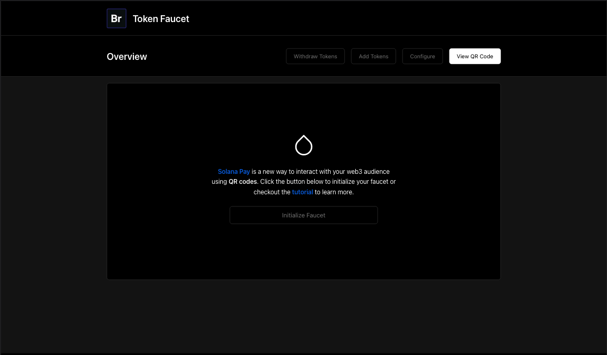
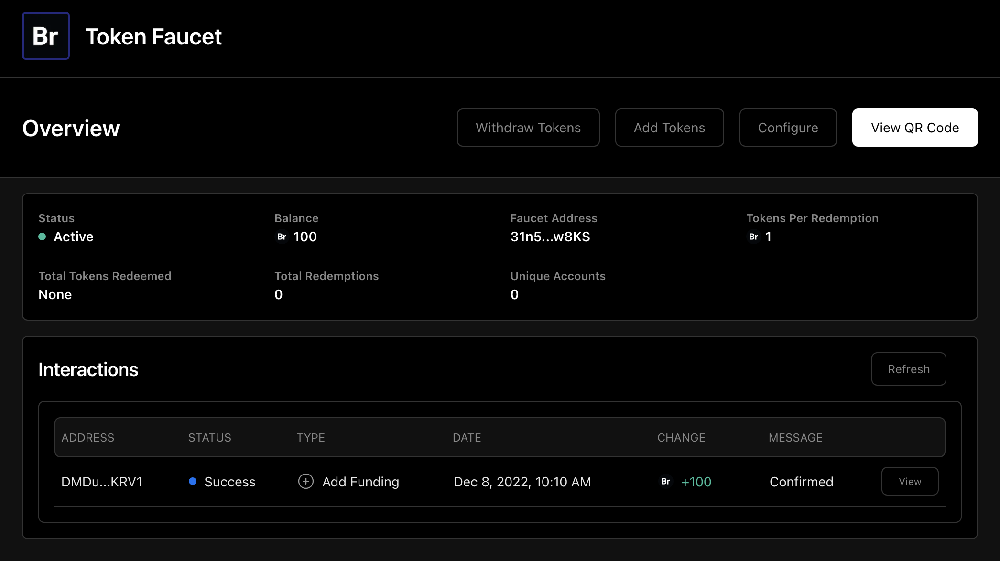
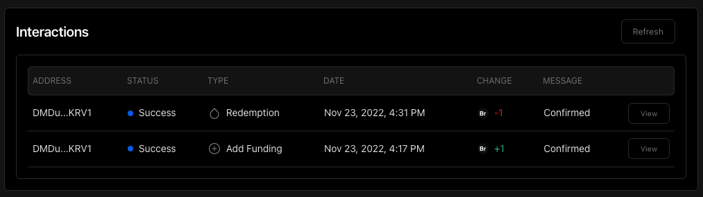

import { Callout } from 'nextra-theme-docs'
import { IncompleteCallout } from '../../components/IncompletePost'

# Getting Started

<IncompleteCallout />

In this series we will be building a Solana token faucet. This is a fairly simple application. The focus here is more on the techniques used to build it rather than the application itself. We use the following stack to build the faucet:
1. [TypeScript](https://github.com/microsoft/TypeScript) + [Node.js](https://nodejs.org/en/) - Language & server runtime
2. [React](https://reactjs.org/) + [Next.js](https://nextjs.org/) + [Recoil.js](https://recoiljs.org/) + [Geist UI](https://geist-ui.dev/en-us) + [Emotion](https://emotion.sh/docs/@emotion/styled) - Web UI
3. [tRPC](https://trpc.io/) + [Express](https://expressjs.com/) - Communication between clients and server
4. [Postgres](https://github.com/postgres/postgres) + [Prisma](https://www.prisma.io/) - Database & ORM
5. [@solana/web3.js](https://github.com/solana-labs/solana-web3.js/) + [@solana/pay](https://github.com/solana-labs/solana-pay) - Solana libraries
7. [ngrok](https://ngrok.com/) - TLS tunneling for local development

We will be adding to this list of technologies as we improve our application over the duration of this series. The following features are already implemented in the [starter repository](https://github.com/bedrock-foundation/faucet-starter) and will be improved upon in future posts:


1. The admin can deposit SPL tokens into the faucet via Solana Pay.
2. The admin can withdraw SPL tokens from the faucet via Solana Pay.
3. The admin can set the amount of tokens that can be claimed from the faucet per account.
4. The admin can view information on a webapp about how wallets are interacting with the faucet.
5. Users can redeem tokens from the faucet via Solana Pay.

The rest of this section will cover setting up the development environment and running the [starter repository](https://github.com/bedrock-foundation/faucet-starter).

## Project Setup

### Clone

Follow the instructions [here](https://docs.solana.com/cli/install-solana-cli-tools) to install or update the Solana CLI tool suite. We are using version 1.9.29.

Clone the repository and install dependencies:
 ```bash
 $ git clone git@github.com:bedrock-foundation/faucet-starter.git
 $ cd faucet-starter
 $ npm install
 ```

 ### Secret Key

Create a new keypair to use for the faucet. **Note:** this is a private key and should never be shared.
 ```bash
 $ solana-keygen new --no-passphrase --outfile ~/.config/solana/keys/bedrock-faucet-tutorial.json
 ```
Update the `FAUCET_SECRET_KEY_PATH` value in the `.env` file in the root of the project with the absolute path to the keypair you just created. For example, my path looks like:
 ``` 
 FAUCET_SECRET_KEY_PATH=/Users/sam-bedrock/.config/solana/keys/bedrock-faucet-tutorial.json
 ```

 ### Postgres

 ### TLS

 ### RPC

By default this project uses the free RPC endpoint for Solana mainnet-beta, however it is likely you will surpass the RPC 
[rate-limits](https://docs.solana.com/cluster/rpc-endpoints#mainnet-beta). If you want to use a different RPC provider (we recommend [Syndica](https://syndica.io/)), 
update the `SOLANA_RPC_ENDPOINT` value in the `.env` file:

 ``` 
 SOLANA_RPC_ENDPOINT=https://solana-api.syndica.io/access-token/<YOUR_SYNDICA_API_TOKEN_HERE>/rpc
 ```

 ### Start

 Start the application in development mode:
 ```bash
 $ npm run dev
 ```
 Open http://localhost:3000 in your web browser. You should see the following view:

 

 Click "Initialize Faucet". This will check that the private key is correctly configured and create a `faucet` object in your database.


## Tokens

We need a token for our faucet to distribute. We've created a test token for this project (Bedrock Test Token) that can be redeemed 
from the QR code below. Scan the QR Code with a Solana Pay compatible wallet and sign the transction to receive 100 BTT.


### Configure Token List

By default, this faucet is configured to redeem 1 BTT per scan, and BTT is the only token that is available during configuration. 
If you're interested in distributing your own token, open `src/shared/utils/TokenUtil.ts` and add your token to `tokenInfoList` array 
following the format specified in the file. Then, back in the web interface, click "Configure" and select your token from the dropdown.

### Add Tokens
Our faucet is now ready for tokens to be deposited. In the web interface click "Add Tokens". Enter the total number of redemptions 
you would like to fund. The total number of tokens required is calclated as the number of redemptions multiplied by the amount of tokens per redemption.
 For example, if you enter 100 redemptions and the amount of tokens per redemption is 1, the total number of tokens required is 100. 

Scan the QR code with a Solana Pay compatible wallet. The wallet will prompt you to transfer the tokens 
to the faucet address. Once the transaction is confirmed on your phone, refresh the browser tab (we'll make faucet information update automatically in 
[tutorial 4](/solana-pay/real-time-updates)) and check to see that the UI has updated with the correct number of tokens. It should look 
something like this:



### Redeem Tokens

To redeem tokens, click "View QR Code" and scan the redemption QR Code with a Solana Pay compatible wallet. Sign the transaction with the wallet and 
refresh the tab when the transaction is confirmed. The interactions table on the UI should update to show that the redemption was successful.

